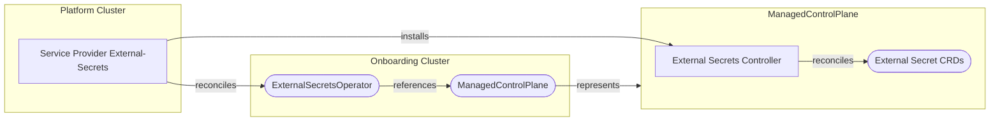

[](https://api.reuse.software/info/github.com/openmcp-project/service-provider-external-secrets)

# Service Provider External Secrets Operator

A service provider for managing [External Secrets Operator](https://external-secrets.io/) within [Open Control Plane](https://openmcp-project.github.io/docs/) environments.

## Architecture Overview

Service Provider External Secrets runs on the platform cluster of an [Open Control Plane installation](https://openmcp-project.github.io/docs/operators/overview). It reconciles `ExternalSecretOperator` resources and installs the [External Secrets Operator](https://external-secrets.io/) to the control plane of the requesting tenant (see [Service Provider Deployment Model](https://openmcp-project.github.io/docs/developers/serviceprovider/design#deployment-model) for more information).



## API Reference

### ExternalSecretsOperator

The `ExternalSecretsOperator` resource represents an External Secret Operator installation for a `ManagedControlPlane`.

```yaml
apiVersion: external-secrets.services.openmcp.cloud/v1alpha1
kind: ExternalSecretsOperator
metadata:
  name: mcp-tenant-a
spec:
  version: "2.2.0"
```

| Field | Type | Description |
|-------|------|-------------|
| `spec.version` | string | The Helm chart version of External Secrets Operator to install |

### ProviderConfig

The `ProviderConfig` resource configures global settings for all External Secret Operator deployments.

```yaml
apiVersion: external-secrets.services.openmcp.cloud/v1alpha1
kind: ProviderConfig
metadata:
  name: externalsecretsoperator
spec:
  pollInterval: 1m
  chartURL: oci://ghcr.io/external-secrets/charts/external-secrets
  chartPullSecret: privateregcred
  helmValues:
    namespaceOverride: eso-system
    global:
      repository: ghcr.io/external-secrets/external-secrets
      imagePullSecrets:
        - name: privateregcred
```

| Field | Type | Description |
|-------|------|-------------|
| `spec.chartURL` | string | OCI registry URL for the External Secrets Operator Helm chart |
| `spec.chartPullSecret` | string | Secret name for chart registry authentication |
| `spec.pollInterval` | duration | periodic reconcile interval to prevent drift of managed MCP resources |
| `spec.helmValues` | object | Custom Helm values for the External Secrets Operator deployment |

For private and air-gapped environments, image locations and pull secrets can be adjusted via `spec.helmValues` global settings (see the example above).
Pull secrets will be synced to each tenant control plane.

## Development Tasks

| Command | Description |
|---------|-------------|
| `task build` | Build the binary |
| `task build:img:build-test` | Build the container image |
| `task test` | Run unit tests |
| `task test-e2e` | Run end-to-end tests |
| `task generate` | Generate CRDs and code after API changes |
| `task validate` | Run linters and formatters |

### Service Provider Runtime Flags

The generated service provider supports the following runtime flags:

- `--verbosity`: Logging verbosity level (see [controller-runtime logging](https://github.com/kubernetes-sigs/controller-runtime/blob/main/TMP-LOGGING.md))
- `--environment`: Name of the environment (required for operation)
- `--provider-name`: Name of the provider resource (required for operation)
- `--metrics-bind-address`: Address for the metrics endpoint (default: `0`, use `:8443` for HTTPS or `:8080` for HTTP)
- `--health-probe-bind-address`: Address for health probe endpoint (default: `:8081`)
- `--leader-elect`: Enable leader election for controller manager (default: `false`)
- `--metrics-secure`: Serve metrics endpoint securely via HTTPS (default: `true`)
- `--enable-http2`: Enable HTTP/2 for metrics and webhook servers (default: `false`)

For a complete list of available flags, run the generated binary with `-h` or `--help`.

## Additional Resources

- [External Secrets Operator Guides](https://external-secrets.io/latest/guides/introduction/)
- [External Secrets Operator Components Overview](https://external-secrets.io/latest/api/components/)
- [Open Control Plane Docs](https://open-control-plane.io)

## Support, Feedback, Contributing

This project is open to feature requests/suggestions, bug reports etc. via [GitHub issues](https://github.com/openmcp-project/service-provider-external-secrets/issues). Contribution and feedback are encouraged and always welcome. For more information about how to contribute, the project structure, as well as additional contribution information, see our [Contribution Guidelines](CONTRIBUTING.md).

## Security / Disclosure

If you find any bug that may be a security problem, please follow our instructions at [in our security policy](https://github.com/openmcp-project/service-provider-external-secrets/security/policy) on how to report it. Please do not create GitHub issues for security-related doubts or problems.

## Code of Conduct

We as members, contributors, and leaders pledge to make participation in our community a harassment-free experience for everyone. By participating in this project, you agree to abide by its [Code of Conduct](https://github.com/SAP/.github/blob/main/CODE_OF_CONDUCT.md) at all times.

## Licensing

Copyright 2025 SAP SE or an SAP affiliate company and service-provider-external-secrets contributors. Please see our [LICENSE](LICENSE) for copyright and license information. Detailed information including third-party components and their licensing/copyright information is available [via the REUSE tool](https://api.reuse.software/info/github.com/openmcp-project/service-provider-external-secrets).
