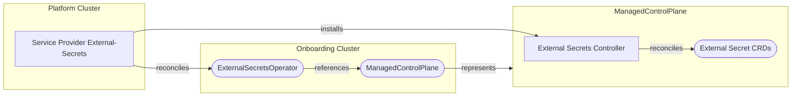

[](https://api.reuse.software/info/github.com/openmcp-project/service-provider-external-secrets)

# Service Provider External Secrets Operator

A service provider for managing [External Secrets Operator](https://external-secrets.io/) within [Open Control Plane](https://openmcp-project.github.io/docs/) environments.

## Architecture Overview

Service Provider External Secrets runs on the platform cluster of an [Open Control Plane installation](https://openmcp-project.github.io/docs/operators/overview). It reconciles `ExternalSecretOperator` resources and installs the [External Secrets Operator](https://external-secrets.io/) to the control plane of the requesting tenant (see [Service Provider Deployment Model](https://openmcp-project.github.io/docs/developers/serviceprovider/design#deployment-model) for more information).


```mermaid
flowchart LR

  subgraph PC[Platform Cluster]
      speso[Service Provider External-Secrets]
  end

  subgraph OC[Onboarding Cluster]
    spapi([ExternalSecretsOperator])
    mcpapi([ManagedControlPlane])

    spapi -- references --> mcpapi
  end

  subgraph mcp[ManagedControlPlane]
    esocontroller[External Secrets Controller]
    esocrd([External Secret CRDs])

    esocontroller -- reconciles --> esocrd
  end

  speso -- reconciles --> spapi
  speso -- installs --> esocontroller
  mcpapi -- represents --> mcp
```

## API Reference

### ExternalSecretsOperator

The `ExternalSecretsOperator` resource represents an External Secret Operator installation for a `ManagedControlPlane`.

```yaml
apiVersion: external-secrets.services.openmcp.cloud/v1alpha1
kind: ExternalSecretsOperator
metadata:
  name: mcp-tenant-a
spec:
  version: "2.2.0"
```

| Field          | Type   | Description                                                    |
| -------------- | ------ | -------------------------------------------------------------- |
| `spec.version` | string | The Helm chart version of External Secrets Operator to install |

Note that any version that should be available to users has to be defined in the `ProviderConfig`.

### ProviderConfig

The `ProviderConfig` resource configures deployment settings for each version of External Secret Operator that the service provider supports.

```yaml
apiVersion: external-secrets.services.openmcp.cloud/v1alpha1
kind: ProviderConfig
metadata:
  name: externalsecretsoperator
spec:
  versions:
    - version: "v2.1.0"
      chartVersion: "2.1.0"
      chartURL: oci://ghcr.io/external-secrets/charts/external-secrets
      chartPullSecret: privateregcred
      helmValues:
        namespaceOverride: eso-system
        global:
          repository: ghcr.io/external-secrets/external-secrets
          imagePullSecrets:
            - name: privateregcred
    - version: "v2.2.0"
      chartVersion: "2.2.0"
      chartURL: oci://ghcr.io/external-secrets/charts/external-secrets
      helmValues:
        namespaceOverride: eso-system
        image:
          repository: ghcr.io/external-secrets/external-secrets
          # -- The image tag to use. The default is the chart appVersion.
          tag: "v2.2.0"
        webhook:
          image:
            repository: ghcr.io/external-secrets/external-secrets
            # -- The image tag to use. The default is the chart appVersion.
            tag: "v2.2.0"
        certController:
          image:
            repository: ghcr.io/external-secrets/external-secrets
            # -- The image tag to use. The default is the chart appVersion.
            tag: "v2.2.0"
```

| Field               | Type     | Description                                                           |
| ------------------- | -------- | --------------------------------------------------------------------- |
| `spec.pollInterval` | duration | periodic reconcile interval to prevent drift of managed MCP resources |
| `spec.versions`     | array    | The versions of Flux that can be installed                            |

A version item is defined as follows:

| Field             | Type   | Description                                                     |
| ----------------- | ------ | --------------------------------------------------------------- |
| `version`         | string | The External Secrets Operator version that this item defines    |
| `chartVersion`    | string | The External Secrets Operator Helm chart version to install     |
| `chartURL`        | string | OCI registry URL for the Helm chart                             |
| `chartPullSecret` | string | Secret name for chart registry authentication                   |
| `helmValues`      | object | Custom Helm values for the External Secrets Operator deployment |

For private and air-gapped environments, image locations and pull secrets can be adjusted via `spec.helmValues` global settings (see the example above).
Pull secrets will be synced to each tenant control plane.

## Development Tasks

| Command                     | Description                              |
| --------------------------- | ---------------------------------------- |
| `task build`                | Build the binary                         |
| `task build:img:build-test` | Build the container image                |
| `task test`                 | Run unit tests                           |
| `task test-e2e`             | Run end-to-end tests                     |
| `task generate`             | Generate CRDs and code after API changes |
| `task validate`             | Run linters and formatters               |

### Service Provider Runtime Flags

The generated service provider supports the following runtime flags:

- `--verbosity`: Logging verbosity level (see [controller-runtime logging](https://github.com/kubernetes-sigs/controller-runtime/blob/main/TMP-LOGGING.md))
- `--environment`: Name of the environment (required for operation)
- `--provider-name`: Name of the provider resource (required for operation)
- `--metrics-bind-address`: Address for the metrics endpoint (default: `0`, use `:8443` for HTTPS or `:8080` for HTTP)
- `--health-probe-bind-address`: Address for health probe endpoint (default: `:8081`)
- `--leader-elect`: Enable leader election for controller manager (default: `false`)
- `--metrics-secure`: Serve metrics endpoint securely via HTTPS (default: `true`)
- `--enable-http2`: Enable HTTP/2 for metrics and webhook servers (default: `false`)

For a complete list of available flags, run the generated binary with `-h` or `--help`.

## Additional Resources

- [External Secrets Operator Guides](https://external-secrets.io/latest/guides/introduction/)
- [External Secrets Operator Components Overview](https://external-secrets.io/latest/api/components/)
- [OpenControlPlane Docs](https://open-control-plane.io)

## Quality Criteria

[](https://open-control-plane.io/developers/serviceprovider/quality-criteria)

| Criterion                         | Status. | Notes                                                                                                                                                                                                                                                                        |
| --------------------------------- | :-----: | ---------------------------------------------------------------------------------------------------------------------------------------------------------------------------------------------------------------------------------------------------------------------------- |
| Deletion behaviour                |    ⚠️    | A finalizer ensures the Service Provider managed resources like Flux' `OCIRepository` and `HelmRelease` are cleaned-up. But there is no behaviour that ensures deletion is blocked if custom resources (e.g. ESO' `ExternalSecret` objects) in a `ControlPlane` still exist. |
| Status reporting & error messages |    ✅    |                                                                                                                                                                                                                                                                              |
| Operation annotations             |    ⚠️    | `openmcp.cloud/operation: ignore` is processed by [opencontrolplane-runtime](https://github.com/openmcp-project/opencontrolplane-runtime). `openmcp.cloud/operation: reconcile` is not processed.                                                                            |
| API stability policy              |    ✅    |                                                                                                                                                                                                                                                                              |
| Custom CA support                 |    ❌    | Custom CA bundle propagation to ESO components is not implemented.                                                                                                                                                                                                           |
| Release artifacts (image + OCM)   |    ✅    |                                                                                                                                                                                                                                                                              |
| Testing                           |    ✅    |                                                                                                                                                                                                                                                                              |
| Ownership and maintenance docs    |    ✅    |                                                                                                                                                                                                                                                                              |

See the [OpenControlPlane Quality Criteria](https://open-control-plane.io/developers/serviceprovider/quality-criteria) for definitions.

## Support, Feedback, Contributing

This project is open to feature requests/suggestions, bug reports etc. via [GitHub issues](https://github.com/openmcp-project/service-provider-external-secrets/issues). Contribution and feedback are encouraged and always welcome. For more information about how to contribute, the project structure, as well as additional contribution information, see our [Contribution Guidelines](CONTRIBUTING.md).

## Security / Disclosure

If you find any bug that may be a security problem, please follow our instructions at [in our security policy](https://github.com/openmcp-project/service-provider-external-secrets/security/policy) on how to report it. Please do not create GitHub issues for security-related doubts or problems.

## Code of Conduct

We as members, contributors, and leaders pledge to make participation in our community a harassment-free experience for everyone. By participating in this project, you agree to abide by its [Code of Conduct](https://github.com/openmcp-project/.github/blob/main/CODE_OF_CONDUCT.md) at all times.

## Licensing

Copyright OpenControlPlane contributors. Please see our [LICENSE](LICENSE) for copyright and license information. Detailed information including third-party components and their licensing/copyright information is available [via the REUSE tool](https://api.reuse.software/info/github.com/openmcp-project/service-provider-external-secrets).

---

<p align="center">
  <a href="https://apeirora.eu/content/projects/">
    
  </a>
</p>

<p align="center">
  OpenControlPlane is part of <a href="https://apeirora.eu/content/projects/">ApeiroRA</a>, an EU Important Project of Common European Interest (IPCEI-CIS).
</p>

<p align="center">
  Copyright Linux Foundation Europe. For web site terms of use, trademark policy and other project policies please see <a href="https://linuxfoundation.eu/en/policies">https://linuxfoundation.eu/en/policies</a>.
</p>
